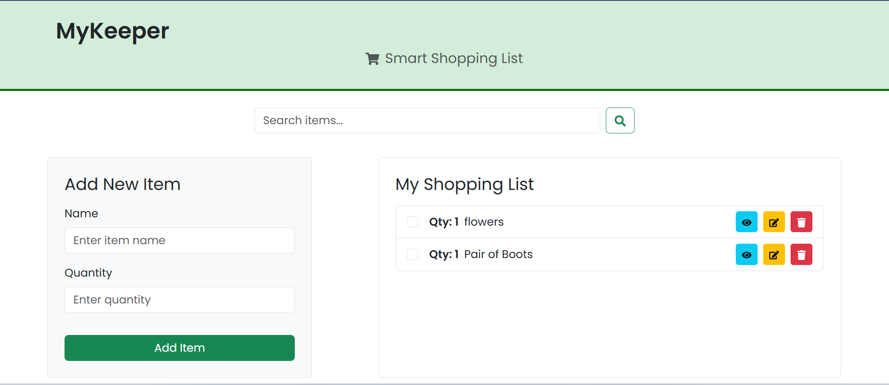
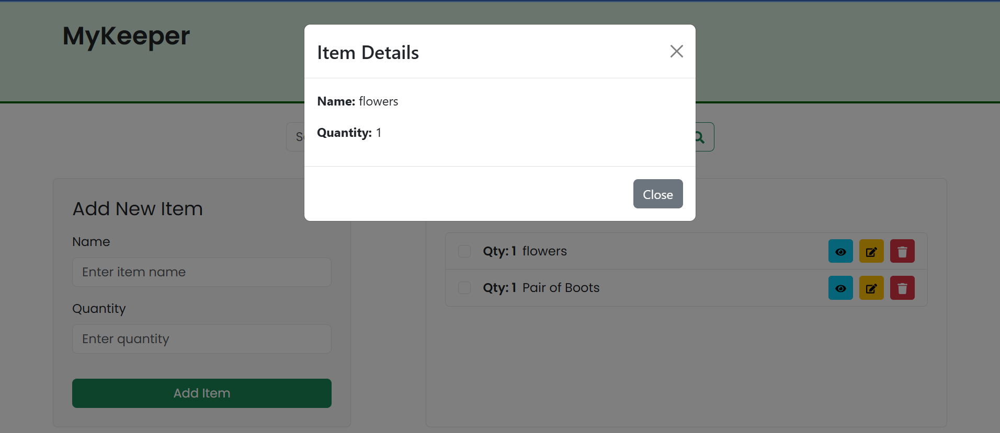

# MyKeeper - Smart Shopping List App

MyKeeper is a full-stack shopping list application built with **React.js** for the frontend and **Node.js + Express** for the backend. It allows users to manage their shopping list by adding, editing, viewing, and deleting items. The data is stored in a JSON file on the server, making it lightweight and easy to use.

---

## Features

### Frontend
- **Add New Items:** Add items to the shopping list with a name and quantity.
- **Edit Items:** Update existing items in the list.
- **Delete Items:** Remove items from the list.
- **View Item Details:** View item details in a modal.
- **Checkbox for Items:** Mark items as checked/unchecked.
- **Responsive Design:** Built with **Bootstrap** and **React-Bootstrap** for a professional and mobile-friendly UI.
- **Icons:** Uses **React Icons** for a modern look.

### Backend
- **REST API:** CRUD operations (Create, Read, Update, Delete) for managing shopping list items.
- **JSON Storage:** Data is stored in a `shoppingList.json` file.
- **Error Handling:** Basic error handling and validation.

---

## Technologies Used

### Frontend
- **React.js**
- **Axios** (for API calls)
- **Bootstrap** (for styling)
- **React-Bootstrap** (for pre-built components)
- **React Icons** (for icons like edit, delete, view, search)

### Backend
- **Node.js**
- **Express.js**
- **CORS** (for cross-origin requests)
- **Body-parser** (for parsing JSON data)

---

## Installation

Follow these steps to set up and run the application locally.

### Prerequisites

- **Node.js** and **npm** installed on your machine.

### Steps

1. **Clone the Repository:**
   ```bash
   git clone https://github.com/Portia-Nelly-Mashaba/Shopping-list-App-NodeJS.git
   cd shopping-list-app-nodejs>
   ```

2. **Set Up the Backend:**
   Navigate to the `backend` folder and install dependencies:
   ```bash
   cd backend
   npm install
   ```

3. **Start the Backend Server:**
   Run the backend server:
   ```bash
   node server.js
   ```
   The backend will run on `http://localhost:5000`.

4. **Set Up the Frontend:**
   Open a new terminal window and navigate to the `frontend` folder:
   ```bash
   cd ../frontend
   npm install
   ```

5. **Start the Frontend:**
   Run the React app:
   ```bash
   npm start
   ```
   The frontend will run on `http://localhost:3000`.

---

## Folder Structure

```
mykeeper-shopping-list/
├── backend/
│   ├── node_modules/
│   ├── shoppingList.json       # JSON file to store shopping list data
│   ├── package.json
│   ├── package-lock.json
│   └── server.js              # Backend server code
├── frontend/
│   ├── node_modules/
│   ├── public/
│   ├── src/
│   │   ├── App.js             # Main React component
│   │   ├── index.js
│   │   └── ...                # Other React files
│   ├── package.json
│   ├── package-lock.json
│   └── README.md
└── README.md                  # This file
```

---

## API Endpoints

The backend exposes the following REST API endpoints:

- **GET `/shopping-list`**: Fetch all shopping list items.
- **POST `/shopping-list`**: Add a new item to the shopping list.
- **PUT `/shopping-list/:id`**: Update an existing item by ID.
- **DELETE `/shopping-list/:id`**: Delete an item by ID.

---

## Screenshots

1. **Shopping List with Add section, Search/Edit/Delete Buttons:**
   

2. **View Item Details Modal:**
   

---

## Testing

### Backend Testing
Use **Postman** or any API testing tool to test the backend endpoints:
- `GET /shopping-list`
- `POST /shopping-list`
- `PUT /shopping-list/:id`
- `DELETE /shopping-list/:id`

### Frontend Testing
Open the app in your browser (`http://localhost:3000`) and interact with the UI to test all features.

---

## Contributing

If you'd like to contribute to this project, please follow these steps:

1. Fork the repository.
2. Create a new branch for your feature or bugfix.
3. Commit your changes.
4. Push your branch and submit a pull request.

---


Enjoy using **MyKeeper**! 🛒